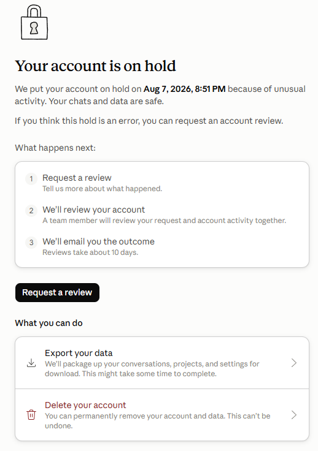
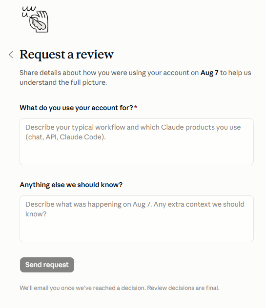
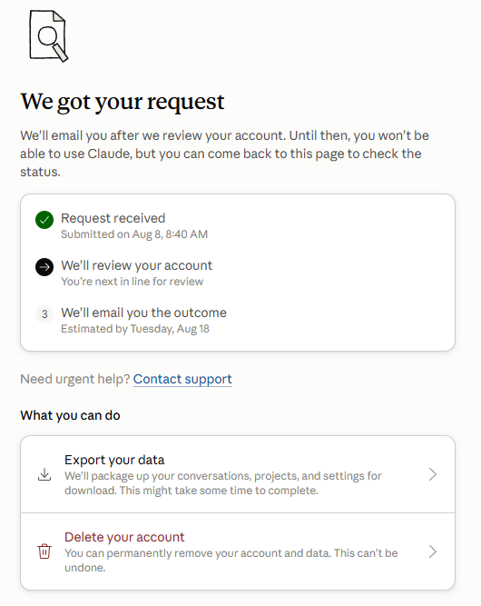

写这篇文章的昨天晚上收到邮件，意思是我的账户被封了：  
Your account has been suspended  
我在想我也没干什么呢？之前的包月claude pro使用一个月都没问题，我的信用卡也是真实的，唯独可能是多台电脑登录造成IP的偏移问题。  

首先尝试在电脑上解决，登录被封的claude账号可以看到：  
  

那么只能按照这个步骤了  

### 第一步：  
立即导出并备份历史数据
在申诉界面下方，Anthropic 提供了数据导出入口：

点击页面底部的 Export your data。

系统打包完成后会提供下载链接，将你之前的对话、项目（Projects）和设置下载到本地。建议先完成这一步，防止申诉未通过导致重要对话丢失。

### 第二步：  
提交官方复核申请（Request a Review）
点击页面中间的黑色按钮 Request a review，在弹出的表格或输入框中填写申诉说明。  

  

申诉要点与建议：
保持网络环境稳定：提交申诉时，请连接稳定且干净的代理节点（避免频繁切换节点或使用多人共享的公用梯子，这往往是触发 unusual activity 的主因）。

说明合理理由：如果是正常使用，请诚恳说明自己是真实个人用户，可能是因为网络 IP 波动或代理切换导致了风控误判。

英文申诉填报自己写太慢，我直接让Gemini帮我写的。  
这里记录一下时间，我是8.8日提交的申请，等着吧。  

第三步：等待复核结果  

  

根据界面提示，接下来就是排队等审核了，通常需要 10 天左右（Reviews take about 10 days）。

提交后请留意你的注册邮箱，官方复核完成后会发送邮件告知处理结果。

这个帖子先写到这等待更新进展...